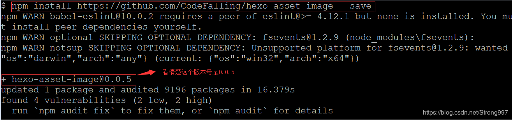
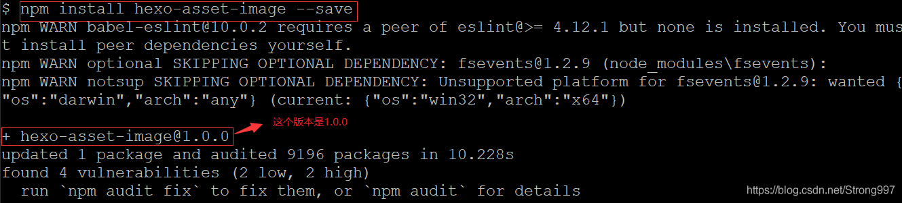
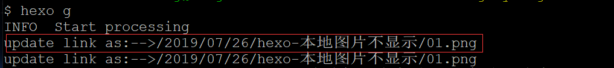
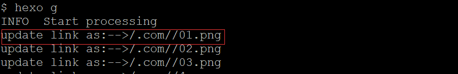

本地编辑md时插入的本地图片，在hexo部署后却不能正常显示。根本原因是hexo在部署的时候对图片的路径进行了xjb修改，加了一层同名目录。

之前一直是迁就了部署目录存放图片，这样导致本地编辑时不能正常预览图片。最近有大量文章需要本地浏览，看不了图太伤了，百度了一下，其实方法也很简单，这个周末把之前的博文全部替换一下图片路径。

<!-- more -->

# 安装插件hexo-asset-image

``` bash
npm install https://github.com/CodeFalling/hexo-asset-image --save
```



注意：**不要使用npm install hexo-asset-image --save这个命令安装,版本号不对**



最直观的感受是映射关系有差别：

0.0.5版本



1.0.0版本



# 配置_config.yml

修改文件`_config.yml`里的`post_asset_folder:`这个选项设置为`true`

修改之后，再使用`hexo n "hexo 本地图片不显示"`时，目录的样子是：

```
    hexo 本地图片不显示
    ├── 01.jpg
    ├── 02.jpg
    └── 03.jpg
    ...
    hexo 本地图片不显示.md
```
# 图片引用

在md使用如下形式引用图片：

```

```

注意 这里要使用`/`

使用以下命令发布博客：

``` bash
hexo cl
hexo g
hexo d
```

注意：**重命名md文件之后记得重命名文件夹，当md文件的名称与文件夹名称不同时，映射关系以md文件名称为主。会导致src图片路径找不到**

# 总结

* 检查`_config.yml`文件的`post_asset_folder:`选项是否为`true`
* 检查创建文件之后的目录结构
* 检查`hexo-asset-image`插件的版本
* 检查路径引用图片的路径使用`/`
* 检查md文件的文件名称和图片存放文件夹名称是否相同

# 参考

1. [Nuub - hexo生成博文插入图片](https://blog.csdn.net/Sugar_Rainbow/article/details/57415705)
2. [99708 - hexo 本地图片不显示](https://blog.csdn.net/Strong997/article/details/97767929)
3. [github - xcodebuild/hexo-asset-image](https://github.com/xcodebuild/hexo-asset-image)