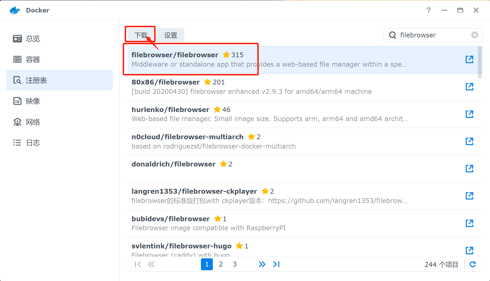
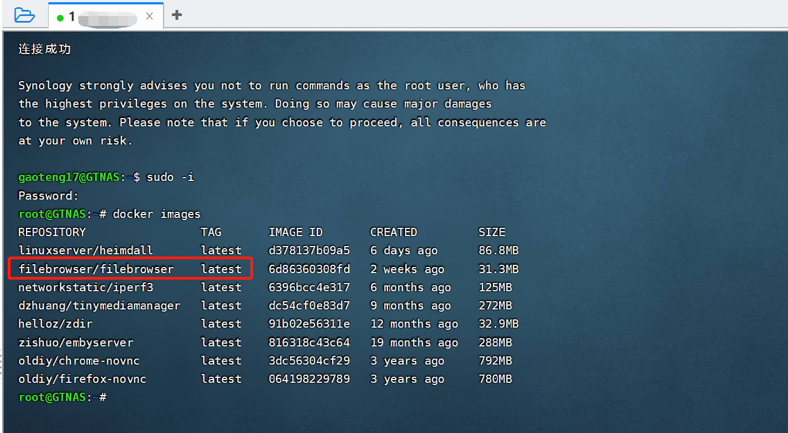
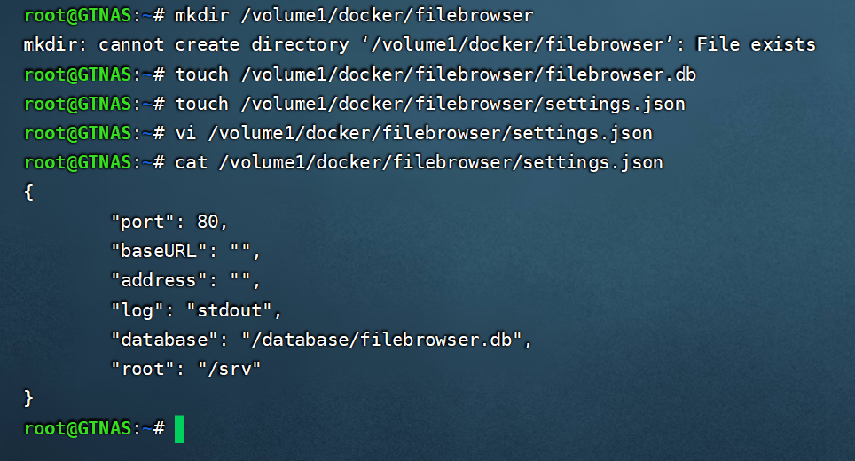
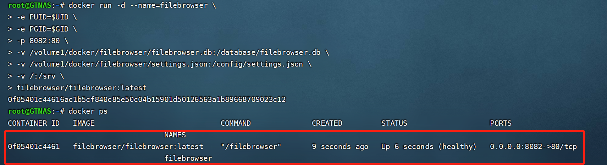
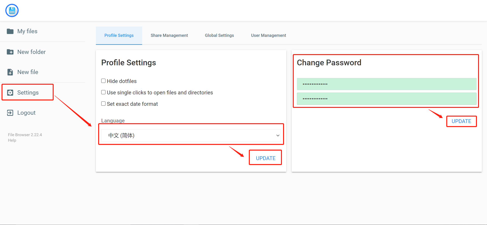
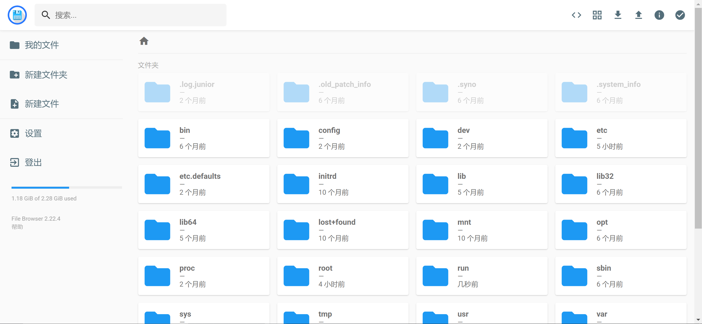
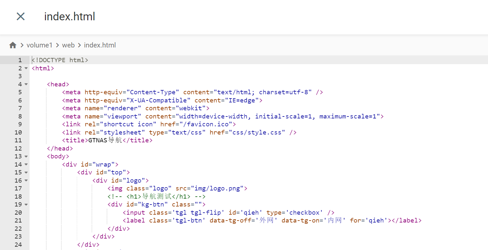
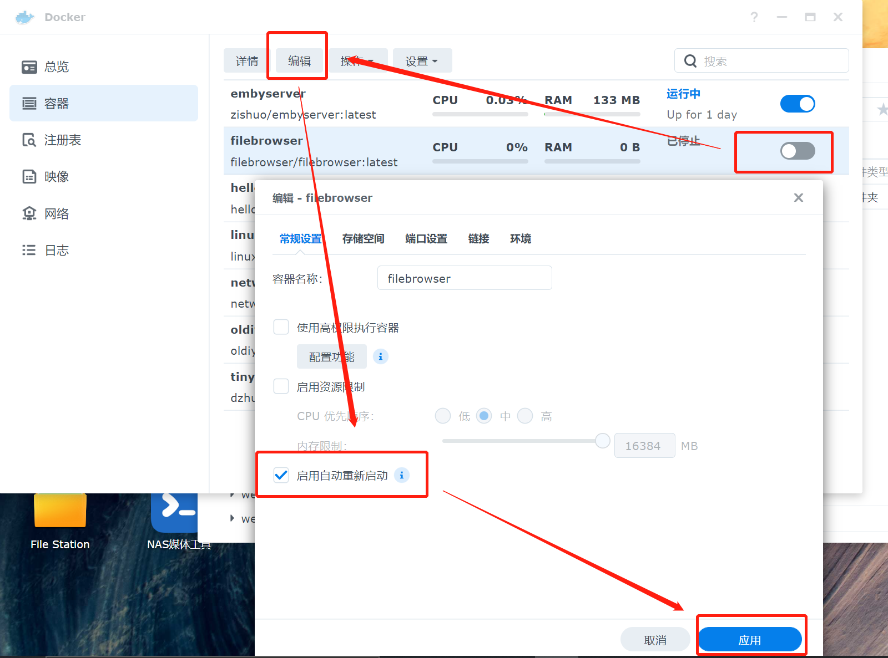

FileBrowser是一个文件浏览器，用来帮助我们利用web网页端管理linux服务器上的文件。这里有人就要说了，群晖本来不就是干文件管理的吗，在群晖上再安装一个这个不是脱裤子放屁吗？
这里我安装FileBrowser的理由是，当把群晖根目录挂载到FileBrowser后，我们可以直接对一些在群晖网页端隐藏的文件进行操作。
例如对docker容器里文件进行操作，一般需要xshell或者finalshell连接到群晖控制台，再进入docker操作。而安装了FileBrowser后，我们可以轻松定位到目录，通过上传下载来替换文件，一些源码的简单修改也可以直接在web端解决。
本文在群晖DSM7.0.1下利用docker安装最新版FileBrowser。

<!-- more -->

# 安装

1. Docker注册表搜索FileBrowser，选择`filebrowser/filebrowser:latest`下载映像。



2. 由于在Docker的web端不能挂载群晖根目录，所以这个容器需要远程连接到群晖控制台利用root权限命令启动。

使用finalshell连接到群晖控制台，切换到root用户，`docker images`查看下载好的镜像。



3. 接下来新建配置文件及目录

``` bash
mkdir /volume1/docker/filebrowser
touch /volume1/docker/filebrowser/filebrowser.db
touch /volume1/docker/filebrowser/settings.json
```

首先新建配置文件目录，这个目录待会要挂载到容器的配置目录。

新建两个空文件，`.db`的数据库保持空文件即可，`vi`编辑`.json`文件，下面是官方给的缺省配置，直接复制即可，编辑完`:wq`保存退出。

``` json
{
  "port": 80,
  "baseURL": "",
  "address": "",
  "log": "stdout",
  "database": "/database/filebrowser.db",
  "root": "/srv"
}
```



4. 然后配置启动参数

``` bash
docker run -d --name=filebrowser \
-e PUID=$UID \
-e PGID=$GID \
-p 8082:80 \
-v /volume1/docker/filebrowser/filebrowser.db:/database/filebrowser.db \
-v /volume1/docker/filebrowser/settings.json:/config/settings.json \
-v /:/srv \
filebrowser/filebrowser:latest
```

其中第一行`--name=`指定容器名称，`-p`表示容器由外部8082端口映射到内部80端口，`-v`分别挂载两个配置文件以及文件主目录`/`到容器的根目录`/srv`，最后一行是使用的镜像名称及版本TAG。

执行完毕后可以看到容器已启动：



# 配置

访问对应地址的8082端口，在设置处修改中文及密码：



这时在主页可以看到群晖系统的根目录，后续修改系统文件、docker文件都会方便很多。



FileBrowser还支持代码高亮，编辑html和php很是方便。



除此外，还能播放音乐、视频等，实测响应速度是比群晖自带文件管理器要快的。


最后也可以在群晖docker里看见这个容器，可以先把它停止一下，在编辑里把自动重启功能打开，避免崩溃后用不了。



如果按照我的配置文件配置了这个文件管理器，我强烈不建议长期开启，因为直接把群晖的系统文件挂载到了这个里，风险太高，尤其暴露在公网环境的话更是要做好安全措施。我这里就是按需启用，平常都是关闭的。