Zdir是一款使用PHP开发的目录列表程序，无需数据库，安装简单，使用方便。

这个程序主要有目录浏览、文件索引、文件搜索、文本查看(代码高亮)、图片预览等功能。

这时又会有人说了，群晖里装文件管理，脱裤子放屁x2。

我安装它的理由是，当需要共享一些文件时（比如软件安装包、系统镜像等），我需要方便快捷的无加密共享出去，同时文件比较多的时候能直接目录搜索。如果每次都要登录群晖创建分享链接，那简直太累了。

这个网盘建好之后我使用起来更像是一个无加密的共享ftp服务器（当然可以设置访问密码）。

本文在群晖DSM7.0.1下利用docker安装最新版Zdir网盘，并对原作者的牛皮癣广告进行处理（我尊重开源，勿杠）。

<!-- more -->

# 安装

1. Docker注册表搜索Zdir，选择`helloz/zdir:latest`下载映像。

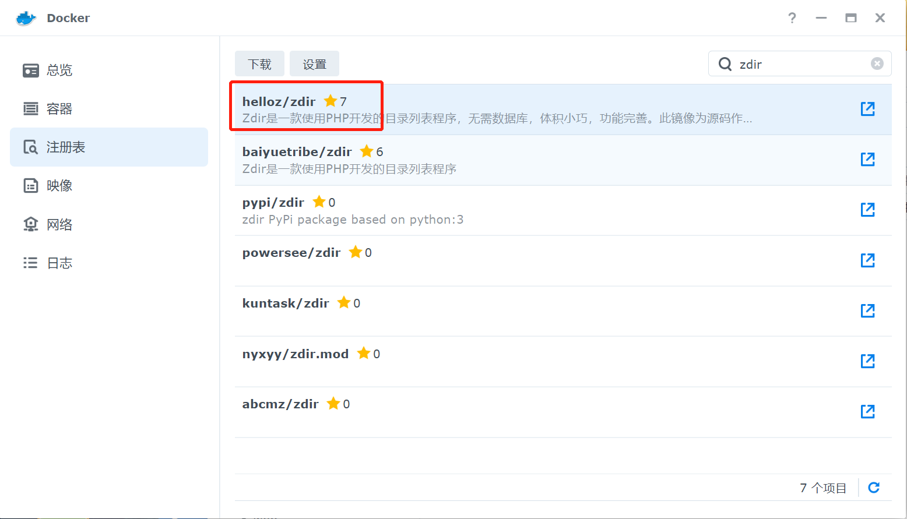

2. 找到映像，启动并配置高权限及自动重启。

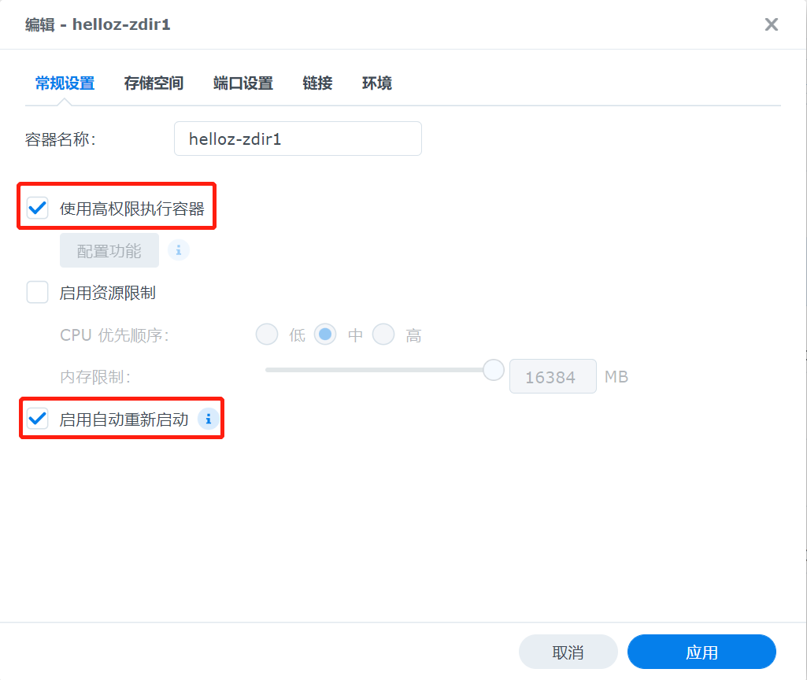

3. 存储空间点击添加文件夹，选择本地想要分享出去的文件夹，然后在装载路径处填写`/data/wwwroot/default/xxx`，其中xxx是容器根目录下你给挂载文件夹起的名字。

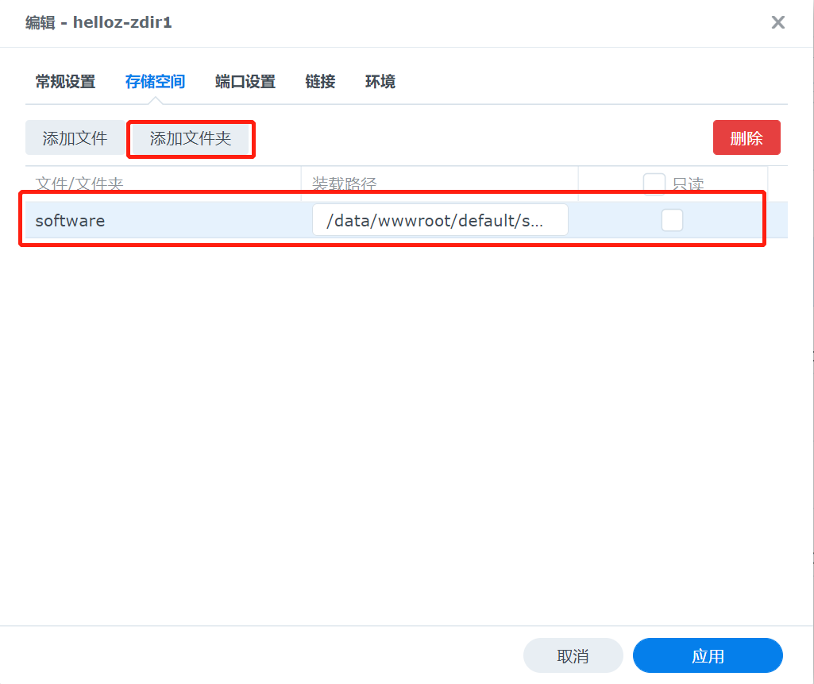

4. 配置端口转发，容器端口80不变，外部端口选择自己喜欢的，建议大一点不容易被扫到。

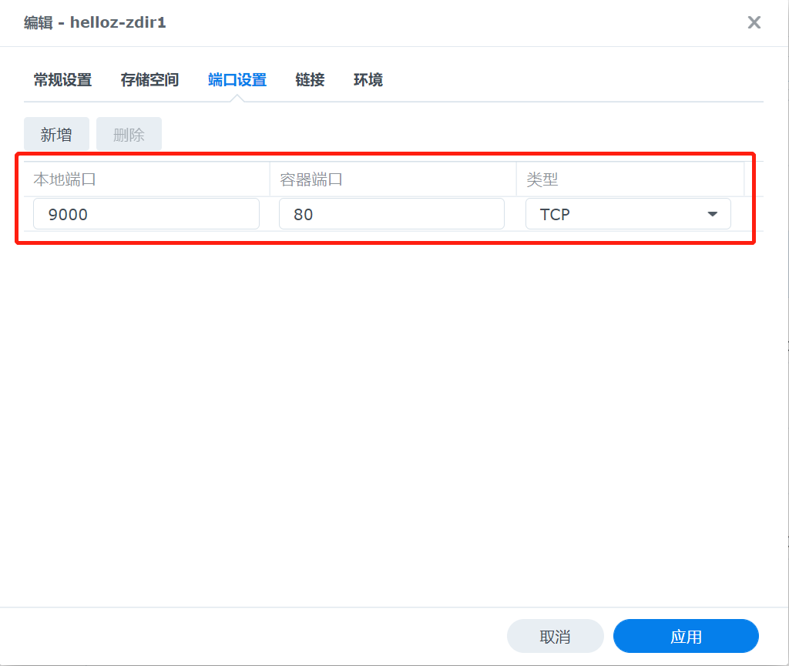

5. 配置完毕后启动，访问可以看到原作者留下的满屏牛皮癣（滑稽）。

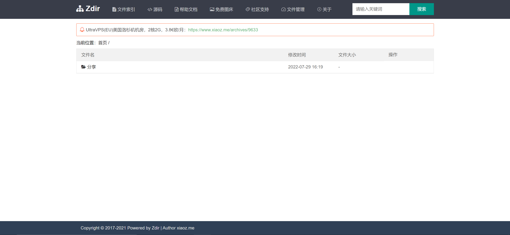

接下来我们来改源码，定制一些个人元素上去。

# 修改源码

## 去滚动广告

finalshell连接到群晖后，查看zdir容器名称，然后进入容器。

``` bash
docker ps
docker exec -it f279f2566efc /bin/sh
```

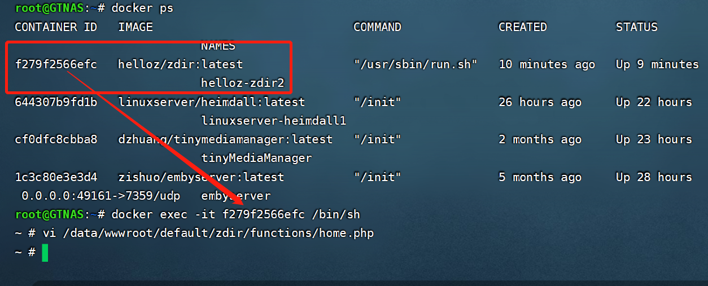

编辑`/data/wwwroot/default/zdir/functions/home.php`文件：

``` bash
vi /data/wwwroot/default/zdir/functions/home.php
```

按`dd`依次删掉126-131行内容：

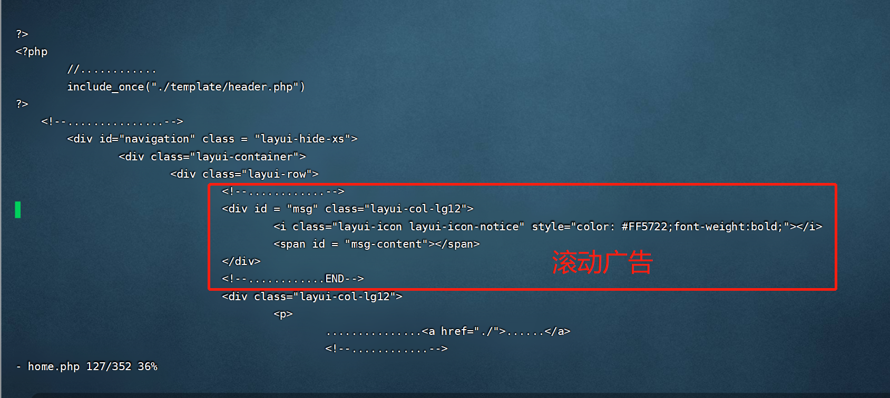

此时滚动广告已经没有了。

## 修改标题、密码

编辑`/data/wwwroot/default/zdir/config.php`文件可以修改标题及密码。

我们可以像上面的方式来修改，但是由于容器对中文支持不好，所以我们也可以使用前文安装的FileBrowser来优雅的进行修改（滑稽）。

首先全局搜索一下zdir容器在群晖中的目录：

``` bash
find / -name zdir
```

得到zdir容器的路径：`/volume1/@docker/volumes/6f99aef8395fb3fb7b3bce5025b57fd3a75d20520d1139342967ab52a7bd9351/_data/zdir`

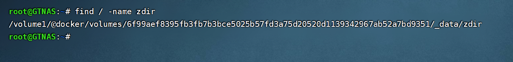

接着用FileBrowser访问zdir容器目录：

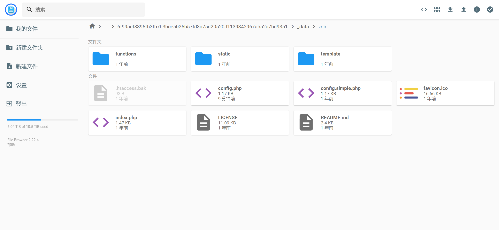

接下来就可以优雅的修改`config.php`了：

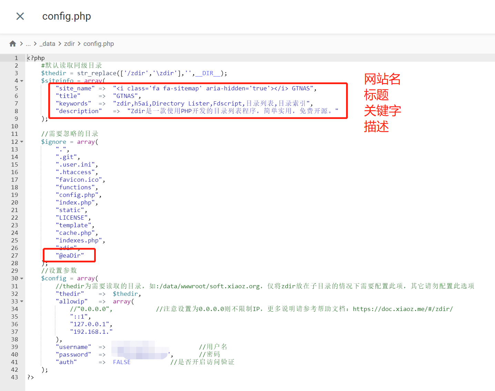

我这里修改了网站名字及标题，下面忽略目录列表里添加了`@eaDir`这个群晖自动生成的隐藏文件夹，最下面设置管理账号密码，如果要启用访问密码记得把FALSE改成TRUE。

保存退出，网站标题就改好了。

## 修改顶部目录

顶部目录文件源码在`zdir/template/header.php`里：

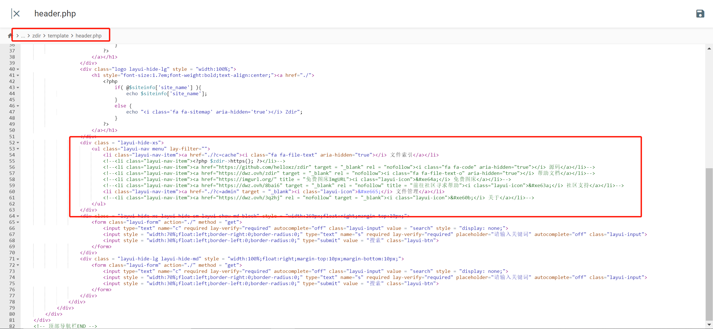

简单的跳转，前面`<a href=`指链接，后面跟页面显示内容。

不想要的直接`<!--`和`-->`注释掉即可。

保存退出，顶部目录就改好了。

## 修改底部内容

顶部目录文件源码在`zdir/template/footer.php`里：

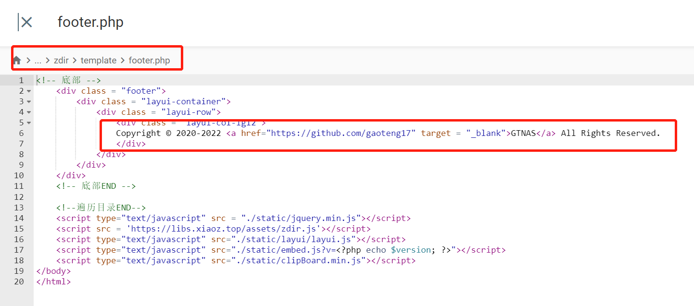

修改完保存退出即可。

修改完最后的整体效果：

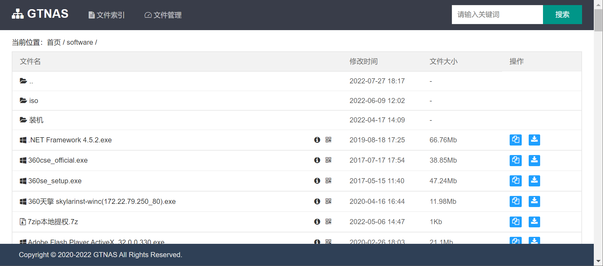